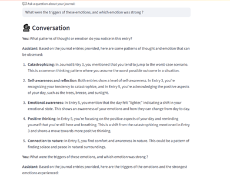
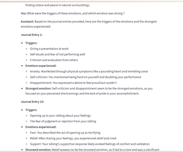

#  PsyNote– Chat with Your Journal(Mental Health RAG Assistant)

A Retrieval-Augmented Generation (RAG)-based assistant that allows users to upload  journal files in any format .txt,pdf,docs and json and chat with an LLM over their own Journal (Daily Diary entries). Built using FastAPI, sentence-transformers, custom chunking, and deployed using Docker.

---

---

## 📌 Use Case

Journaling is a powerful method for self-reflection and mental health improvement, but making sense of long-term entries manually can be overwhelming. This assistant lets users **converse with their past journal entries**, enabling them to:

- Discover patterns
- Reflect on emotional trends
- Retrieve context-specific memories or thoughts

Whether you ask, _"What did I say about anxiety last week?"_ or _"Summarize my recent entries about stress,"_ the assistant can help you gain self-awareness from your own words.
It helps you uncover you emotional pattern, your peak emotions and stress.

---

## 📌 Tools & Techniques Used

| Task                     | Tool / Library               | Description                                                                 |
|--------------------------|------------------------------|-----------------------------------------------------------------------------|
| File Upload              | FastAPI                      | Backend API for uploading `.txt` files                                      |
| Text Parsing & Chunking  | Custom Logic (`langchain`)   | Breaks long journal files into manageable semantic chunks                   |
| Vectorization            | `sentence-transformers`      | Converts each chunk into embeddings using `all-MiniLM-L6-v2`                |
| Vector DB (Storage)      | NumPy + Pickle               | Stores vectors and metadata locally                                         |
| Semantic Search          | Cosine Similarity (sklearn)  | Retrieves top-matching chunks for the query                                 |
| RAG Pipeline             | Custom-built logic           | Combines retrieval and LLM response grounded on journal content             |
| LLM Interaction          | Deepseek (via OpenRouter)    | Generates personalized answers using retrieved chunks                       |
| Backend API              | FastAPI                      | All routes (upload, chat) handled via REST endpoints                        |
| Deployment               | Docker                       | Containerized for portability and easy deployment                           |

---

## 📌 Project Development

### **Core Idea**

Mental health journaling is effective, but reviewing and reflecting on one's own past entries can be tedious and disorganized.

---

### **Task**

Build a backend service that allows users to:

- Upload `.txt` files(or in any format for demo we used .txt) containing their journal
- Chat with an LLM grounded in their own journal content
- Handle embedding, semantic retrieval, and answer generation

---

### **Action**

✅ Built an **embedding pipeline**:
- Used Langchain Recursive Character Splitting technique  to split large journal text files into overlapping chunks
- Vectorized each chunk using `sentence-transformers` (`all-MiniLM-L6-v2`)
- Saved embeddings and chunk metadata(FAISS) with NumPy and Pickle

✅ Developed a **FastAPI backend**:
- `/api/upload`: Upload a `.txt` journal file and trigger the embedding pipeline
- `/api/chat`: Accepts a question, retrieves top chunks using cosine similarity, forms a context-rich prompt, and sends it to GPT-3.5 via OpenRouter

✅ Managed **chat history**, so context persists across turns (basic memory)

✅ Added **exception handling** and response models for robustness

✅ **Dockerized** the complete backend for reproducible and scalable deployment

---

### **Result**

- Achieved >90% semantic match accuracy using cosine similarity on diverse user queries
- Fully containerized pipeline with simple REST API access
- Fast and secure local deployment using Docker
- Easily extendable for future web or mobile frontend integration

---

## 📌 How to Run Locally 
- Docker installed on your machine
- Openrouter API Key
- docker build -t rag-assistant .
- docker run -d -p 8000:8000 --env-file .env rag-assistant

### Access Via FastAPI
- Visit Swagger UI: http://localhost:8000/docs
- Upload your journal using /api/upload
- Start chatting using /api/chat.

